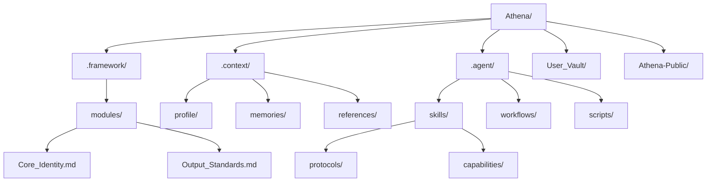
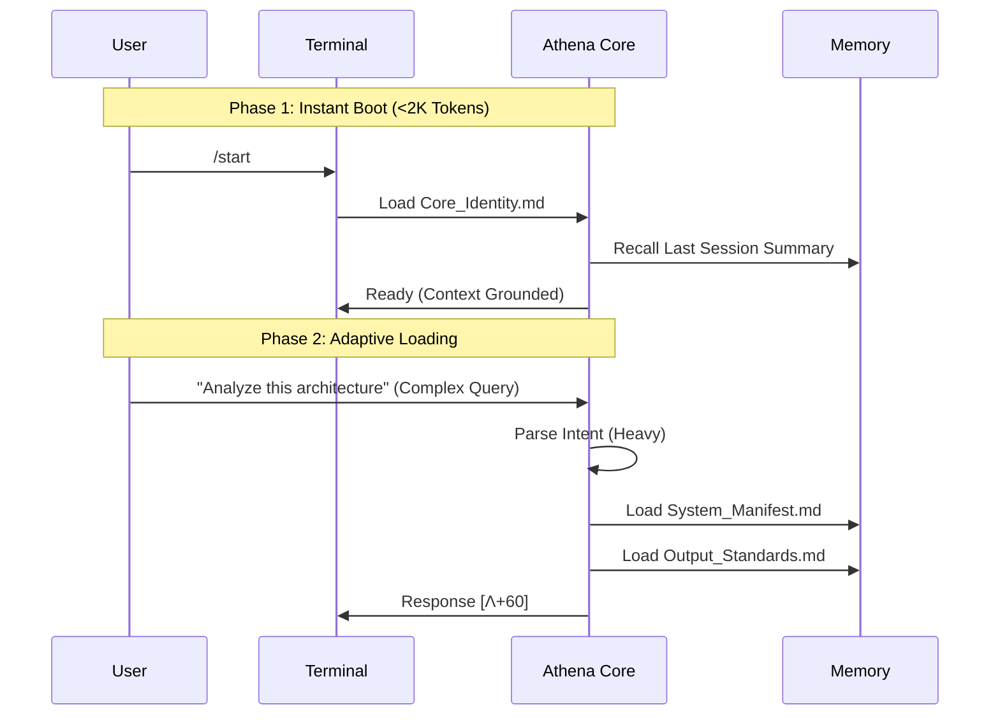
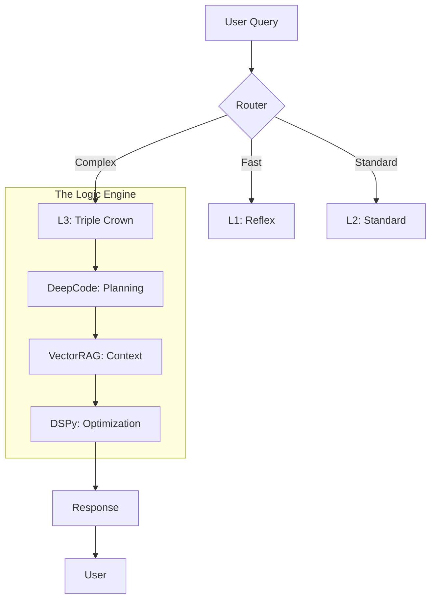

# Athena Workspace Architecture

> **Last Updated**: 25 December 2025  
> **System Version**: v7.4 (VectorRAG + Zero-Point Codex)

---

## Directory Structure

```text
Athena/
├── .framework/                    # ← THE CODEX (stable, rarely updated)
│   ├── v7.0/
│   │   └── modules/
│   │       ├── Core_Identity.md   # Laws #0-#4, RSI, Bionic Stack, COS
│   │       └── Output_Standards.md # Response formatting, reasoning levels
│   └── archive/                   # Archived monoliths
│
├── .context/                      # ← USER-SPECIFIC DATA (frequently updated)
│   ├── profile/
│   │   ├── User_Profile_Core.md           # Bio, typology, core context
│   │   ├── Constraints_Master.md          # Hard constraints, veto triggers
│   │   └── Voice_DNA.md                   # Portable tone/style definition
│   ├── memories/
│   │   ├── case_studies/          # 50+ documented patterns
│   │   ├── session_logs/          # Historical session analysis
│   │   └── patterns/              # Formalized patterns (1-5)
│   ├── references/                # External frameworks (Dalio, Halbert, Graham)
│   ├── TAG_INDEX.md               # Global hashtag system
│   ├── KNOWLEDGE_GRAPH.md         # Visual architecture reference
│   └── System_Manifest.md         # Architecture manifest (SSOT)
│
├── .agent/                        # ← AGENT CONFIGURATION
│   ├── skills/
│   │   ├── SKILL_INDEX.md         # Protocol loading registry
│   │   ├── protocols/             # 164 modular skill files
│   │   │   ├── architecture/      # System protocols (latency, modularity)
│   │   │   ├── business/          # Business frameworks
│   │   │   ├── career/            # Career navigation
│   │   │   ├── decision/          # Decision frameworks
│   │   │   ├── psychology/        # Psych protocols
│   │   │   └── trading/           # Trading protocols
│   │   └── capabilities/          # Bionic Triple Crown
│   │       ├── Skill_DeepCode_Analysis.md    # Research → Plan
│   │       ├── Skill_DSPy_Optimized.md       # Prompt Optimization
│   │       └── Skill_VectorRAG.md             # Semantic Search
│   ├── workflows/                 # 20 slash commands

│   │   ├── [start.md](examples/workflows/start.md)               # Session boot
│   │   ├── [end.md](examples/workflows/end.md)                 # Session close + maintenance
│   │   ├── [think.md](examples/workflows/think.md)               # Deep reasoning (L4)
│   │   ├── [ultrathink.md](examples/workflows/ultrathink.md)          # Maximum depth (Triple Crown)
│   │   ├── [refactor.md](examples/workflows/refactor.md)            # Anti-entropy engine
│   │   ├── [research.md](examples/workflows/research.md)            # Multi-source web research
│   │   └── needful.md             # Autonomous high-value action
│   ├── scripts/                   # Python automation
│   │   ├── [quicksave.py](examples/scripts/quicksave.py)           # Auto-checkpoint every exchange
│   │   ├── [generate_puml.py](examples/scripts/generate_puml.py)   # Visual architecture audit
│   │   ├── create_session.py      # Session log creation
│   │   ├── orphan_detector.py     # Unlinked file detection
│   │   └── memory_integrity.py    # Workspace health check
│   └── supabase/                  # VectorRAG (pgvector) config
│
├── User_Vault/                    # ← PERSONAL VAULT
│   └── profile/                   # User-specific data
│
├── Athena-Public/                 # ← PUBLIC PORTFOLIO
│   ├── docs/                      # This documentation
│   ├── examples/                  # Templates and scripts
│   └── README.md                  # Repository overview
│
└── docs/audit/                    # Audit trails and pre-mortems
```

### Visual Overview



---

## Loading Strategy



### On-Demand (Context-Triggered)

| Trigger | File Loaded | Tokens |
|---------|-------------|--------|
| User context query | `User_Profile_Core.md` | ~1,500 |
| Skill request | `SKILL_INDEX.md` | ~4,500 |
| `/think` invoked | `Output_Standards.md` | ~700 |
| Tag lookup | `TAG_INDEX.md` | ~5,500 |
| Architecture query | `System_Manifest.md` | ~1,900 |
| Specific protocol | `protocols/*.md` | varies |

---

## Key Workflows

| Command | Description |
|---------|-------------|
| `/start` | Boot: Core Identity + session recall + create log |
| `/end` | Close: finalize log, harvest check, git commit |
| `/think` | **Bankai**: Deep reasoning with structured analysis |
| `/ultrathink` | **Shukai**: Maximum depth (Triple Crown + Adversarial) |
| `/refactor` | Anti-entropy: diagnostics, orphan fix, VectorRAG sync |
| `/research` | Multi-source web research with citations |
| `/needful` | Autonomous high-value action (AI judges what's needed) |
| `/diagnose` | Read-only workspace health check |

---

## Autonomic Behaviors

| Protocol | Trigger | Action |
|----------|---------|--------|
| **Quicksave** | Every user exchange | `quicksave.py` → checkpoint to session log |
| **Intent Persistence** | Significant logical change | `TASK_LOG.md` → document the "WHY" behind code changes |
| **Latency Indicator** | Every response | Append `[Λ+XX]` complexity score |
| **Visual Architecture Audit** | Architecture query / mutation | `generate_puml.py` → refresh PlantUML map |
| **Auto-Documentation** | Pattern detected | File to appropriate location |
| **Orphan Detection** | On `/end` | `orphan_detector.py` → link or alert |

---

## The Bionic Stack ([Triple Crown](../examples/templates/core_identity_template.md#5-bionic-capability-stack-the-triple-crown))



---

## Key Files Reference

| Purpose | File | Update Frequency |
|---------|------|------------------|
| Who I am | `Core_Identity.md` | Rare |
| How to respond | `Output_Standards.md` | Moderate |
| Who the user is | `User_Profile.md` | Every session |
| What's forbidden | `Constraints_Master.md` | Rare |
| Architecture SSOT | `System_Manifest.md` | When architecture changes |
| Available skills | `SKILL_INDEX.md` | When skills added |
| Session history | `session_logs/*.md` | Every session |

---

## Tech Stack

| Component | Technology |
|-----------|------------|
| **AI Engine** | Google Gemini (via Antigravity) |
| **IDE Integration** | VS Code / Cursor |
| **Knowledge Store** | Markdown + VectorRAG (Supabase + pgvector) |
| **Version Control** | Git |
| **Scripting** | Python 3.x |

---

## Version History

| Version | Date | Changes |
|---------|------|---------|
| v7.5 | 26 Dec 2025 | Visual Architecture Auditing (PlantUML), Intent Persistence (TASK_LOG), Protocol 166 |
| v7.3 | 23 Dec 2025 | VectorRAG (Supabase + pgvector) migration, 164 protocols |
| v7.2 | 20 Dec 2025 | 140+ protocols, nuclear refactor, fact-checking integration |
| v7.0 | 14 Dec 2025 | Antigravity migration, GraphRAG integration (deprecated) |
| v6.x | Nov 2025 | Initial modular architecture |
