# Architecture: The Digital Hub

> **Philosophy**: A centralized identity node (Hub) connecting specialized project spokes.
> **Stack**: Static HTML5/CSS3 (GitHub Pages) for maximum robustness and zero maintenance.

## System Topology

```mermaid
graph TD
    User([User / Recruiter]) --> Hub[winstonkoh87.github.io]
    
    subgraph "The Hub (Presentation Layer)"
        Hub --> Hero[Hero Section: Identity]
        Hub --> Projects[Featured Work: Projects]
        Hub --> Pillars[Philosophy: 3-Pillars]
    end
    
    subgraph "The Spokes (Evidence Layer)"
        Projects --> Athena[Project Athena]
        Projects --> SMEServices[SME Digital Services]
        Projects --> Future[Future Apps...]
    end
    
    subgraph "Infrastructure (The Metal)"
        Athena -->|Hosted on| GitHub[GitHub Repo]
        Hub -->|Hosted on| Pages[GitHub Pages]
        Pages -->|Cached by| Fastly[GitHub CDN]
    end

    classDef hub fill:#1e293b,stroke:#3b82f6,stroke-width:2px;
    classDef spoke fill:#0f172a,stroke:#64748b,stroke-width:1px;
    classDef infra fill:#0f172a,stroke:#22c55e,stroke-width:1px;
    
    class Hub,Hero,Projects,Pillars hub;
    class Athena,SMEServices,Future spoke;
    class GitHub,Pages,Fastly infra;
```



## Directory Structure

```text
/
├── index.html          # Entry Point (Landing)
├── about.html          # Identity & Bio
├── framework.html      # Intellectual IP
├── writing.html        # Blog Wrapper
├── contact.html        # Conversion Point
├── human.txt           # Credits / Easter Egg
├── robots.txt          # SEO Directives
├── sitemap.xml         # Search Index
│
├── assets/             # Static Assets
│   ├── css/            # Style Sheets
│   ├── js/             # Interactive Scripts
│   └── img/            # Vector Images / Icons
│
└── docs/               # Documentation
    └── ARCHITECTURE.md # System Design (You are here)
```

## Design Decisions

1. **Static-First**: No database, no backend, no server-side rendering. Why? Because a portfolio must **never** fail.
2. **Zero-Build**: No `npm install`. No `webpack`. The code you see is the code that runs. This ensures the site is future-proof for 10+ years.
3. **Hub & Spoke**: The central site is thin. It links out to thick projects. This keeps the identity clean while allowing infinite depth in portfolio items.
