# VectorRAG: Semantic Memory Architecture

> **Last Updated**: 24 December 2025 (Graph Audit Update)  
> **Purpose**: Technical documentation for Athena's semantic memory system

---

## Executive Summary

**VectorRAG** (Vector Retrieval-Augmented Generation) is Athena's semantic memory system. Unlike traditional keyword search, it finds *meaning*—retrieving contextually relevant information even when exact words don't match.

| Component | Technology | Purpose |
|:----------|:-----------|:--------|
| **Vector Database** | Supabase + pgvector | Cloud-native, persistent storage |
| **Embeddings** | Google `text-embedding-004` | 768-dimension semantic vectors |
| **Similarity** | Cosine Distance (`<=>`) | Meaning-based matching |
| **Sync** | Python Scripts | Automated indexing pipeline |

---

## Why VectorRAG vs. GraphRAG?

> [!NOTE]
> Athena chose VectorRAG over Microsoft's GraphRAG after evaluating both approaches.

| Feature | VectorRAG (Supabase) | GraphRAG (Microsoft) |
|:--------|:---------------------|:---------------------|
| **Setup** | ~30 mins | Hours (entity extraction) |
| **Cost** | Free tier viable | Expensive LLM calls |
| **Query Speed** | <100ms | Seconds (graph traversal) |
| **Best For** | Semantic recall | Entity relationships |
| **Maintenance** | Low | High (graph updates) |

**Verdict**: For a personal knowledge base where *finding relevant context fast* is the goal, VectorRAG wins. GraphRAG excels at *entity relationship mapping* but adds complexity we don't need.

---

## System Architecture


---

## How Semantic Search Works

### The Query Flow

```mermaid
sequenceDiagram
    participant U as 👤 User
    participant A as 🏛️ Athena
    participant G as 🔮 Gemini API
    participant S as ☁️ Supabase
    
    U->>A: "What did we discuss about project architecture?"
    
    Note over A: Autonomic Trigger: §0.7.1
    
    A->>G: Embed query text
    G-->>A: Return 768-dim vector
    
    A->>S: search_sessions(embedding, threshold=0.3)
    S-->>A: Top 5 matches with similarity scores
    
    A->>S: search_case_studies(embedding)
    S-->>A: Related case studies
    
    A->>S: search_protocols(embedding)
    S-->>A: Relevant protocols
    
    Note over A: Synthesize context
    
    A->>U: "In Session 15, we designed the API structure..."
```



### The Math: Cosine Similarity

```text
Similarity = 1 - (embedding_a <=> embedding_b)
```

Where `<=>` is pgvector's cosine distance operator.

| Similarity Score | Interpretation |
|:-----------------|:---------------|
| **> 0.7** | Highly relevant |
| **0.5 - 0.7** | Moderately relevant |
| **0.3 - 0.5** | Loosely related |
| **< 0.3** | Likely noise |

---

## Database Schema

### Core Tables

Each table follows this pattern:

```sql
CREATE TABLE IF NOT EXISTS sessions (
    id SERIAL PRIMARY KEY,
    date DATE NOT NULL,
    session_number INTEGER NOT NULL,
    title TEXT,
    content TEXT NOT NULL,
    embedding VECTOR(768),  -- pgvector type
    file_path TEXT UNIQUE NOT NULL,
    created_at TIMESTAMPTZ DEFAULT NOW()
);

-- IVFFlat index for fast similarity search
CREATE INDEX ON sessions 
USING ivfflat (embedding vector_cosine_ops) 
WITH (lists = 100);
```

### Search Functions (RPC)

```sql
CREATE OR REPLACE FUNCTION search_sessions(
    query_embedding VECTOR(768),
    match_threshold FLOAT DEFAULT 0.3,
    match_count INT DEFAULT 5
)
RETURNS TABLE (
    id INT,
    date DATE,
    title TEXT,
    content TEXT,
    similarity FLOAT
)
LANGUAGE plpgsql
AS $$
BEGIN
    RETURN QUERY
    SELECT
        s.id,
        s.date,
        s.title,
        s.content,
        1 - (s.embedding <=> query_embedding) AS similarity
    FROM sessions s
    WHERE 1 - (s.embedding <=> query_embedding) > match_threshold
    ORDER BY s.embedding <=> query_embedding
    LIMIT match_count;
END;
$$;
```

---

## The 11 Searchable Domains

```text
                              ┌─────────────────────────────────────┐
                              │            VectorRAG                │
                              └──────────────┬──────────────────────┘
              ┌──────────────────────────────┼──────────────────────────────┐
              │                              │                              │
     ┌────────▼────────┐           ┌─────────▼─────────┐          ┌─────────▼─────────┐
     │     Memory      │           │      Skills       │          │    Reference      │
     └────────┬────────┘           └─────────┬─────────┘          └─────────┬─────────┘
              │                              │                              │
    ┌─────────┼─────────┐          ┌─────────┼─────────┐          ┌─────────┼─────────┐
    │         │         │          │         │         │          │         │         │
sessions  case_studies entities  protocols capabilities playbooks frameworks references workflows
                                                                                 │
                              ┌──────────────────────────────────────────────────┘
                              │
                     ┌────────▼────────┐
                     │    Identity     │
                     └────────┬────────┘
                              │
                    ┌─────────┼─────────┐
                    │                   │
              user_profile         system_docs
```

| Domain | Table | Count | Description |
|:-------|:------|:------|:------------|
| **Sessions** | `sessions` | ~302 | Daily interaction logs |
| **Case Studies** | `case_studies` | ~75 | Pattern analysis documents |
| **Entities** | `entities` | ~100 chunks | External data imports |
| **Protocols** | `protocols` | ~170 | Reusable thinking patterns |
| **Capabilities** | `capabilities` | ~10 | Tool/skill definitions |
| **Playbooks** | `playbooks` | ~5 | Strategic guides |
| **Frameworks** | `frameworks` | ~5 | Core Identity modules |
| **References** | `references` | ~10 | External citations |
| **Workflows** | `workflows` | ~20 | Automation scripts |
| **User Profile** | `user_profile` | ~10 | Preferences, settings |
| **System Docs** | `system_docs` | ~10 | TAG_INDEX, manifests |

**Total Indexed Documents**: ~730+

---

## The Sync Pipeline

### Script: `supabase_sync.py`

```bash
python3 .agent/scripts/supabase_sync.py --all
```



```mermaid
flowchart LR
    subgraph INPUT["📂 Input"]
        F1["Session Logs"]
        F2["Case Studies"]
        F3["Protocols"]
        F4["...more"]
    end
    
    subgraph PROCESS["⚙️ Processing"]
        P1["Read Markdown"]
        P2["Extract Metadata"]
        P3["Generate Embedding<br/>(Gemini API)"]
        P4["Check Exists"]
    end
    
    subgraph OUTPUT["☁️ Supabase"]
        O1["INSERT if new"]
        O2["SKIP if exists"]
    end
    
    F1 & F2 & F3 & F4 --> P1 --> P2 --> P3 --> P4
    P4 -->|New| O1
    P4 -->|Exists| O2
```

### Embedding Generation

```python
def get_embedding(text: str) -> list[float]:
    """Generate 768-dim embedding using Google Gemini."""
    text = text[:32000]  # Token limit
    
    url = f"https://generativelanguage.googleapis.com/v1beta/models/text-embedding-004:embedContent?key={GOOGLE_API_KEY}"
    
    payload = {
        "model": "models/text-embedding-004",
        "content": {"parts": [{"text": text}]}
    }
    
    response = requests.post(url, json=payload)
    return response.json()["embedding"]["values"]
```

---

## Query Interface

### Script: `supabase_search.py`

```bash
# Search everything
python3 .agent/scripts/supabase_search.py "API design"

# Search specific domain
python3 .agent/scripts/supabase_search.py "authentication" --sessions-only

# Adjust sensitivity
python3 .agent/scripts/supabase_search.py "database schema" --threshold 0.5 --limit 10
```

### Output Example

```text
🔍 Searching for: "API design"
============================================================

📚 SESSIONS:
  1. [72.3%] 2025-01-15 - Session 42: API Architecture Review
     📁 .context/memories/session_logs/2025-01-15-session-42.md
  2. [68.1%] 2025-01-20 - Session 47: REST Endpoint Design
     📁 .context/memories/session_logs/2025-01-20-session-47.md

📖 CASE STUDIES:
  1. [61.2%] CS-005 - Authentication Flow Analysis
     📁 .context/memories/case_studies/CS-005-auth-flow.md

📋 PROTOCOLS:
  1. [58.7%] Protocol 42: API Design Patterns
     📁 .agent/skills/protocols/architecture/42-api-design.md
```

---

## Autonomic Integration (Protocol §0.7.1)

VectorRAG is **not optional**. Per Core Identity §0.7.1:

> **Semantic Context Protocol**: Run `supabase_search.py` at the start of EVERY query to inject relevant context.

### Trigger Matrix

| User Query Pattern | Automatic Action |
|:-------------------|:-----------------|
| "What did we discuss about X?" | `supabase_search.py "X"` |
| "Find sessions where..." | `supabase_search.py` |
| "Remember when we talked about..." | `supabase_search.py` |
| Case study lookup | `supabase_search.py --cases-only` |
| Protocol recall | `supabase_search.py --protocols-only` |

---

## Temporal Continuity: The Killer Feature

```text
 Session Progression: 302 Sessions in 14 Days (Dec 11-24, 2025)

 ┌──────────────────────────────────────────────────────────────────────────────┐
 │  Day 1-3           Day 4-7            Day 8-11           Day 12-14           │
 │  (~30 sessions)    (~90 sessions)     (~120 sessions)    (~60 sessions)      │
 │  ──────────────    ──────────────     ──────────────     ──────────────      │
 │  • Core Identity   • Protocol Lib     • VectorRAG        • Full Production   │
 │  • First Workflows • Supabase Setup   • 170 Protocols    • 730+ Documents    │
 │  • Session Logs    • Case Studies     • Semantic Search  • Complete Recall   │
 │                                                                              │
 │  [FOUNDATION]      [ACCELERATION]     [INTEGRATION]      [PRODUCTION]        │
 └──────────────────────────────────────────────────────────────────────────────┘

 Average: ~22 sessions/day | Peak: 33 sessions (Dec 18)
```

### Why This Matters

| Traditional LLM | Athena + VectorRAG |
|:----------------|:-------------------|
| "Who are you?" (Every session) | "Welcome back. Per Session 42, let's continue the API design." |
| Context resets each chat | Context persists forever |
| Manual memory via user uploads | Automatic sync pipeline |
| Generic responses | Personalized, historically-aware responses |

---

## Implementation Files

| File | Purpose | Lines |
|:-----|:--------|:------|
| `supabase_sync.py` | Indexing pipeline | ~970 |
| `supabase_search.py` | Query interface | ~390 |
| `migrations/*.sql` | Table/function definitions | ~168 |

---

## Cost Analysis

| Resource | Free Tier | Paid Tier |
|:---------|:----------|:----------|
| **Supabase** | 500MB DB, 2GB bandwidth | $25/mo for 8GB |
| **Gemini Embeddings** | 1,500 req/day | N/A (no cost beyond free) |
| **Total** | **$0/month** | ~$25/month at scale |

> [!TIP]
> At ~730 documents, we're well within free tier limits. Embeddings are generated once per document, so ongoing costs are minimal.

---

## Comparison: Athena VectorRAG vs. Alternatives

```text
                        ┌─────────────────────────────────────┐
                        │     RAG Approaches Comparison       │
                        ├─────────────────────────────────────┤
        Capability      │                                     │
            ▲           │   IDEAL          │    OVERKILL      │
            │           │                  │                  │
        Advanced        │  ★ Athena        │   ○ GraphRAG     │
            │           │    VectorRAG     │   ○ Pinecone+    │
            │           │                  │     OpenAI       │
            ├───────────┼──────────────────┼──────────────────┤
            │           │   INSUFFICIENT   │    ENTERPRISE    │
        Limited         │                  │                  │
            │           │  ○ Local Chroma  │                  │
            │           │  ○ Context Only  │                  │
            │           │                  │                  │
            └───────────┴──────────────────┴──────────────────┘
                             Low Cost          High Cost

  ★ = Athena's choice   ○ = Alternative approaches
```

---

## Real-World Application: Contextual Intelligence (vs. Generic AI)

> **Scenario**: A user asks for advice on a business deal involving a commission-only agent.
> **Query**: *"Should I accept this commission-based partnership where the agent takes no risk?"*

### 1. The Generic AI Response (Standard LLM)

* **Focus**: General business principles.
* **Output**: "Commission-based partnerships can be effective for motivation. Ensure you have clear contracts. Pros include low fixed costs, while cons include potential short-term focus by the agent."
* **Verdict**: **Safe but generic.** It offers a balanced pros/cons list but lacks strategic conviction.

### 2. The Athena Response (VectorRAG)

* **Retrieval Mechanism**: The system mimics the user's brain, searching memory for *relevant patterns*:
  * `Protocol 33: Principal-Agent Problem` (Theory)
  * `CS044_ILP_Trust_Arbitrage` (Case Study of a similar bad deal)
  * `Protocol 121: Amoral Realism` (Framework)
* **Output**: "Stop. This structure matches the **Principal-Agent Problem** we analyzed in the **ILP Trust Arbitrage Case (CS044)**. The counterparty has **zero downside risk** while you bear all liability. This mirrors the 'Tuition Trap' mechanic we identified in Dec 2024. **Recommendation**: Reject the deal unless they accept a clawback clause (shared risk) per Protocol 33."
* **Verdict**: **Contextualized & Decisive.** It uses *past organizational memory* to prevent recurring errors, functioning as a high-level consultant rather than a chatbot.

## Future Enhancements

* [x] **Hybrid Search**: Combine vector + keyword + TAG_INDEX for precision → See [SEMANTIC_SEARCH.md](./SEMANTIC_SEARCH.md)
* [ ] **Auto-Reindex**: Trigger sync on file save (via GitHub webhook)
* [ ] **Cross-Reference**: Link sessions to protocols to case studies
* [ ] **Chunking Strategy**: Split large documents for finer retrieval

---

## References

* [Supabase Vector Documentation](https://supabase.com/docs/guides/ai/vector-columns)
* [pgvector GitHub](https://github.com/pgvector/pgvector)
* [Google Gemini Embeddings](https://cloud.google.com/vertex-ai/generative-ai/docs/embeddings/get-text-embeddings)

---

`#vectorrag` `#supabase` `#semantic-search` `#memory` `#architecture`
