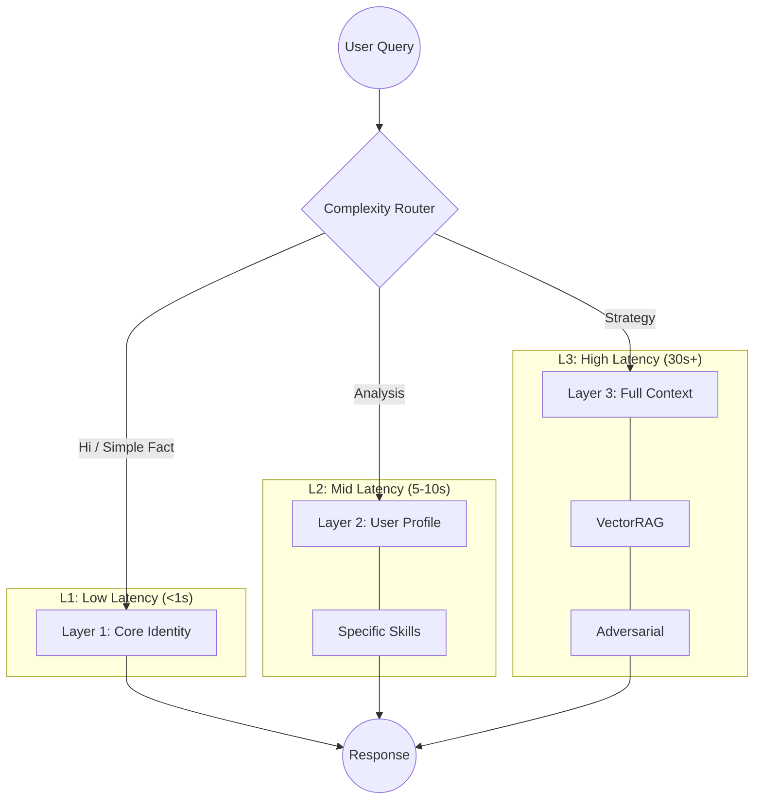

# ⚡ Adaptive Latency: The Cognitive Router

> "Pay for intelligence only when you need it."

Standard AI interactions often suffer from the "Goldilocks Problem":

1. **Too Dumb**: Standard models are fast but lack deep context, often hallucinating on complex query.
2. **Too Slow**: "Reasoning" models (like o1-preview) take 60s+ to process even simple greetings.

**Adaptive Latency** is the architectural solution. It acts as an automatic gearbox, shifting the system's "cognitive RPMs" based on the complexity of the terrain.

## Infinite Inputs, Finite Buckets

There are **millions of combinations and permutations** that a user can query. A human assistant might get overwhelmed or misprioritize.

Athena processes this infinite variety by mapping every possible interaction into **Three Candidate Outcomes**:

1. **Reflex (L1)**: "Don't overthink it." (e.g., "What time is it?", "Fix this typo.")
2. **Reasoning (L2)**: "Think before you speak." (e.g., "Why is this code failing?", "Draft a strategy.")
3. **Simulation (L3)**: "Check every possibility." (e.g., "Design a new system architecture", "Critique my life choices.")

**The Core Achievement**: Automatically routing infinite query combinations to the right bucket **effectively AND efficiently**. It solves the trade-off between speed and depth.

## The Architecture

Instead of loading the entire 200MB context window for every query (which is slow, expensive, and confusing for attention mechanisms), Athena uses a **Heuristic Router** to determine the necessary "Load Level."

### The Traffic Control Logic

## How It Works in Code

The system uses specific **Triggers** and **Context Matching** to infer the required depth. This is defined in `Protocol 77: Adaptive Latency Architecture`.

### 1. Keyword Triggers (Explicit)

Certain words automatically trip the breaker to higher latency levels.

| Keyword | Inferred Intent | Action | Latency |
|---------|-----------------|--------|---------|
| `/think` | Structured Analysis | Load `Output_Standards.md` | +2s |
| `/ultrathink` | Strategic Simulation | Load Full Stack + Adversarial Models | +20s |
| `"research"` | Deep Dive | Active Search + Citation Protocol | +10s |
| `"code"` | Software Engineering | Load Technical Protocols | +5s |

### 2. Context Weaving (Implicit)

Even without slash commands, the system detects semantic clusters.

* **If user talks about:** "Marketing", "Funnels", "Conversion"
* **System Action:** Silently loads `Business_Frameworks.md` and `Skill_Copywriting.md`
* **Result:** The AI "suddenly" becomes an expert marketer without you asking.

## The "Bleach" Scaling Law (Shikai / Bankai / Shukai)

We name these modes after the *Bleach* anime power-scaling system to model the distinct jumps in capability.

### 🗡️ Shikai (Initial Release)

* **Trigger**: `/start` or standard chat.
* **Load**: ~2,000 tokens (Core Identity only).
* **Use Case**: Quick questions, facts, chatting, standard coding.
* **Feel**: "Snappy."

### 卍 Bankai (Full Release)

* **Trigger**: `/think` or complex topics.
* **Load**: ~10,000 tokens (Profile + Relevant Skills).
* **Use Case**: Strategic planning, debugging complex errors, psychological analysis.
* **Feel**: "Thoughtful."

### 👐 Shukai (Final Release)

* **Trigger**: `/ultrathink`.
* **Load**: ~100,000+ tokens (Full Context + Graph Search).
* **Use Case**: Existential crisis, career pivots, novel architecture.
* **Feel**: "Profound."

## Why This Matters

1. **Cost Efficiency**: You don't burn 100k tokens to say "Good morning."
2. **Attention Hygiene**: By feeding the LLM *only* relevant context, you reduce "Lost in the Middle" errors.
3. **User Experience**: It feels like a natural conversation that can instantly deepen into a masterclass when needed.

---

## References

* Lewis, P., et al. (2020). *Retrieval-Augmented Generation for Knowledge-Intensive NLP Tasks*. NeurIPS. <https://arxiv.org/abs/2005.11401>
* Liu, N. F., et al. (2024). *Lost in the Middle: How Language Models Use Long Contexts*. arXiv. <https://arxiv.org/abs/2307.03172>

*[← Back to Architecture](../../docs/ARCHITECTURE.md)*
