# 🏛️ Athena: Personal AI Digital Assistant


> **Built with Google AI Antigravity** — A framework for creating your own AI-powered personal knowledge management system.
---

## Executive Summary (STAR Framework)

### Situation

After 10+ years in financial services, I found myself drowning in fragmented information — career transition research in one folder, coding notes in another, mental models scattered across chat logs and loose files. Every AI conversation started from zero. Context was lost. Insights were forgotten.

### Task

I needed more than a note-taking app. I needed a **"second brain"** — one that could remember everything, reason with me, and evolve over time. Something that could handle deep introspection *and* technical debugging in the same session.

### Action

I built **Athena**: a hybrid-cloud cognitive system powered by the **[Triple Crown Stack](https://github.com/winstonkoh87/Athena-Public/blob/main/examples/templates/core_identity_template.md#5-bionic-capability-stack-the-triple-crown)** (Gemini + Supabase + Edge Functions).

- Researched and integrated best practices from [Anthropic's Agents.md](https://github.com/anthropics/anthropic-cookbook/blob/main/patterns/agents/README.md), [Supabase pgvector](https://supabase.com/docs/guides/ai/vector-columns), and [Stanford's DSPy](https://github.com/stanfordnlp/dspy)
- Designed **[Laws #0-#4](https://github.com/winstonkoh87/Athena-Public/blob/main/examples/templates/core_identity_template.md)** as hard-coded safety rails and decision principles
- Built **[3-Phase Temporal Workflow](#the-workflow-temporal-flow)** (`/start` → Execute → `/end`) for continuous context inheritance
- Implemented **[Edge Functions](#tech-stack)** for automated "iCloud-like" memory synchronization
- Created **[194 Protocols](https://github.com/winstonkoh87/Athena-Public/blob/main/examples/templates/SKILL_INDEX_template.md)** as reusable thinking patterns for everything from trading to design

### Result

| Metric | Value |
|--------|-------|
| **Build Time** | <30 days |
| **Monthly Cost** | <SGD 30 |
| **Sessions Logged** | 352+ |
| **[Protocols](https://github.com/winstonkoh87/Athena-Public/blob/main/examples/templates/SKILL_INDEX_template.md)** | 198 |
| **[Automation Scripts](https://github.com/winstonkoh87/Athena-Public/blob/main/examples/scripts/)** | 88 |
| **[Workflows](https://github.com/winstonkoh87/Athena-Public/blob/main/examples/workflows/)** | 23 |
| **Embedded Documents** | 750+ (VectorRAG) |
| **System Architecture** | [Architecture](ARCHITECTURE.md) |
| **VectorRAG Architecture** | [VectorRAG](VECTORRAG.md) |

**Impact:**

- **[Zero-Latency Recall](https://github.com/winstonkoh87/Athena-Public/blob/main/examples/concepts/adaptive_latency.md)**: Instant context from any past session — no more "who are you again?"
- **100% Context Continuity**: Every session builds on the last. Session 272 knows what Session 1 decided.
- **~40% faster decisions**: Via "[Triple Crown](https://github.com/winstonkoh87/Athena-Public/blob/main/examples/templates/core_identity_template.md#5-bionic-capability-stack-the-triple-crown)" reasoning (Domain + Adversarial + Cross-Domain analysis)

This isn't just an AI assistant. It's a cognitive extension that grows smarter with every interaction.

👉 [→ See Architecture](#the-architecture) | [→ Tech Stack](#tech-stack) | [→ About Me](#about-me)

---

## 💼 What I Have Learned

| Skill Area | Evidence |
|------------|----------|
| **System Design** | Architecting hybrid cloud systems (local files + Supabase vectors + Edge Functions) from scratch |
| **Automation** | Writing 90 Python scripts for knowledge management & CI/CD via Git webhooks |
| **AI/ML Integration** | Implementing VectorRAG (pgvector), semantic search, and Gemini API orchestration |
| **DevOps** | Deploying Serverless Edge Functions (TypeScript/Deno) and automated sync pipelines |
| **Product Thinking** | Applying the STAR framework, user journey mapping, and continuous iteration |
| **Documentation** | Building a self-documenting system with 194 reusable protocols |

> *This project represents my journey from "user" to "builder." It is a production-grade personal infrastructure I rely on daily.*

---

## 🎬 Quick Demo

[](https://winstonkoh87.github.io/Athena-Public/examples/demo.html)

*Click to view the **live interactive demo** → [winstonkoh87.github.io/Athena-Public/examples/demo.html](https://winstonkoh87.github.io/Athena-Public/examples/demo.html)*

---

## Table of Contents

1. [Executive Summary](#executive-summary-star-framework)
2. [Quick Demo](#-quick-demo)
3. [What Is This?](#what-is-this)
4. [Tech Stack](#tech-stack)
5. [How It Works](#how-it-works)
6. [Reasoning Modes](#-reasoning-modes-the-bleach-scaling-law)
7. [Anti-Hallucination Architecture](#-anti-hallucination-architecture)
8. [VectorRAG Architecture](VECTORRAG.md)
9. [Example Workflows](#example-workflows)
10. [The Domain Bridge](#-the-domain-bridge-finance--ai)
11. [Why I Built This](#why-i-built-this)
12. [Build Your Own](#how-you-can-build-your-own)
13. [The Paradigm Shift](#the-paradigm-shift)
14. [Living Roadmap](#-living-roadmap)
15. [References](#-references)
16. [About Me](#about-me)

---

## 🗺️ Living Roadmap

See where the system is heading: [**View the Living Roadmap**](https://github.com/winstonkoh87/Athena-Public/blob/main/ROADMAP.md)

- ✅ **Recall**: VectorRAG (Supabase + pgvector), Protocols, Temporal Continuity → [**Deep Dive: VectorRAG Architecture**](VECTORRAG.md)
- ✅ **Mobile Access**: Telegram Bot (Athena-Lite) for field notes
- 🚧 **Augmentation**: Voice Interface, Advanced Grounding
- 🔮 **Autonomy**: Daily Briefing Agent, Recursive Self-Optimization

---

## The Paradigm Shift

> **Old Model**: Learning syntax (4-6 weeks).  
> **New Model**: Architecting solutions (< 2 hours).

AI-Augmented Engineering isn't about replacing skill; it's about shifting from **Execution** to **Intent, Direction, and Verification**.

[→ Read the full concept: **The Paradigm Shift**](https://github.com/winstonkoh87/Athena-Public/blob/main/examples/concepts/paradigm_shift.md) | [**Amoral Realism**](https://github.com/winstonkoh87/Athena-Public/blob/main/examples/concepts/amoral_realism.md)

---

## What Is This?

**Athena** is my personal AI digital assistant that helps me manage my life. It's not a chatbot — it's a **cognitive extension** that:

- 📚 **Remembers everything** — Sessions, decisions, insights, and patterns
- 🧠 **Thinks with me** — Strategic analysis, decision frameworks, and reasoning
- 🛠️ **Founder Mode** — Deep skip-level analysis; rejects "black-box" management
- ⚡ **Automates workflows** — Serverless Edge Functions for sync, indexing, and backups
- 🔄 **Evolves over time** — Learns my preferences and calibrates to my thinking style
- 🕸️ **[VectorRAG](https://supabase.com/docs/guides/ai/vector-columns)-powered** — Hybrid memory: Local Files + Cloud Vectors (Supabase + pgvector)

I built this using [Google AI Antigravity](https://ai.google.dev) (Gemini Code Assist) as my development partner.

[**→ Read the Origin Story: The Raison d'Être of Athena**](https://github.com/winstonkoh87/Athena-Public/blob/main/examples/concepts/origin_story.md)

---

## 🏦 The Domain Bridge (Finance → AI)

**"Why is a finance guy building AI systems?"**

My 10+ years in financial services taught me that **Edge = Information Asymmetry + Execution Velocity**.

I didn't build Athena just to "code." I built it to encode **institutional-grade decision frameworks** into a machine that never sleeps.

- **14 Trading Protocols**: Encoded risk management, position sizing, and psychological calibration.
- **System 2 Thinking**: Athena doesn't just "chat"; it runs `Protocol 46 (Trading Methodology)` to check biases before every decision.
- **Ruin Prevention**: Hard-coded **Law #1** (No Irreversible Ruin) directly from Taleb's *Incerto*, applied to code and career.

Athena is the synthesis of **Financial Discipline** and **Software Scalability**.

---

## Why I Built This

After working with AI coding assistants, I realized they could do more than just write code. What if an AI could:

1. **Understand my context** — Personal goals, constraints, and decision-making patterns
2. **Maintain continuity** — Remember past conversations and build on them
3. **Operate proactively** — Auto-document insights, catch patterns, prevent mistakes

The result is Athena — a living knowledge system that grows smarter with every interaction.

---

## ⚔️ Reasoning Modes (The Bleach Scaling Law)

Athena operates on three distinct levels of cognitive latency, scalable to the problem's complexity. Each mode is activated by a specific slash command:

| Mode | Trigger | Analogy | Description |
|------|---------|---------|-------------|
| **Shikai** | `/start` | [*Adaptive Latency*](https://github.com/winstonkoh87/Athena-Public/blob/main/examples/concepts/adaptive_latency.md) | The default state. Conversational, low-latency responses for standard tasks. |
| **Bankai** | `/think` | *Chain of Thought* | Multi-step reasoning. Deliberate, 3-track analysis (Domain, Adversarial, Cross-Domain). |
| **Shukai** | `/ultrathink` | *Master Release* | Maximum depth mode. Solves complex multi-domain issues using zero-point inversion and exhaustive simulation. |

---

---

## 🎨 Capability: Flash UI (Metaphorical Design Injection)

Athena isn't just backend logic. I use it to act as a **Creative Director** for frontend engineering, breaking the "Generic Bootstrap" trap.

> **Protocol 142**: "Metaphorical Design Injection" forces the LLM to access physical/material latent space clusters before generating CSS.

| Feature | Description |
|---------|-------------|
| **Semantic Injection** | "Make it look like a Porsche dashboard" → Generates `obsidian-black` hex codes and tight, high-contrast spacing. |
| **Vibe Coding** | Iterative refinement via **[Protocol 130](https://github.com/winstonkoh87/Athena-Public/blob/main/examples/protocols/130-vibe-coding.md)**, focusing on "feel" over syntax. |
| **Speed** | Concept → Production-ready HTML/CSS in <60 seconds. |
| **No Figma** | I skip design tools entirely. The code *is* the canvas.

[→ See [Protocol 130](https://github.com/winstonkoh87/Athena-Public/blob/main/examples/protocols/130-vibe-coding.md) (Vibe Coding)](<https://github.com/winstonkoh87/Athena-Public/blob/main/examples/protocols/130-vibe-coding.md>) | [See [Protocol 98](https://github.com/winstonkoh87/Athena-Public/blob/main/examples/protocols/98-strategic-depth-theory.md) (Strategic Depth)](<https://github.com/winstonkoh87/Athena-Public/blob/main/examples/protocols/98-strategic-depth-theory.md>) | [Protocol Template](https://github.com/winstonkoh87/Athena-Public/blob/main/examples/templates/protocol_template.md)

---

## How It Works

### The Architecture

**Athena serves me.** It's my personal knowledge infrastructure — I plugged in an AI engine (Gemini, Claude, etc.) and now it handles everything from personal projects to consulting to web development.

**Cost: <SGD 30/month** (Google AI Pro subscription). That's it.

```plaintext
Athena/
├── .framework/      # Identity & Laws — Who the AI is, how it reasons
├── .context/        # My Context — Profile, memories, case studies
├── .agent/          # Capabilities — 22 workflows, 90 scripts, 194 protocols
└── User_Vault/      # Personal Vault — Documents, data, private files
```

**👉 Explore the examples:**

- [Core Identity Template](https://github.com/winstonkoh87/Athena-Public/blob/main/examples/templates/core_identity_template.md) — How to define your AI's personality
- [Protocol Template](https://github.com/winstonkoh87/Athena-Public/blob/main/examples/templates/protocol_template.md) — Reusable thinking pattern format
- [Session Log Template](https://github.com/winstonkoh87/Athena-Public/blob/main/examples/templates/session_log_template.md) — Continuous memory structure

### The Workflow (Temporal Flow)

Unlike a generic LLM where you start from zero every time, Athena operates on a **continuous timeline**.

#### Phase 1: The Boot (`/start`)

*You press start. The system wakes up and loads your entire context instantly.*

```mermaid
flowchart LR
    USER((👤 user)) -->|"Type /start"| BOOT
    
    subgraph BOOT["⚡ Phase 1: The Boot"]
        direction TB
        A[Load Core Identity] --> B[Recall Last Session]
        B --> C[Check To-Do List]
        C --> D[Establish Current Date/Time]
    end
    
    BOOT -->|"Context Established"| READY{✅ READY}
```



#### Phase 2: The Active Loop

*You ask a question. The system searches memory first, synthesizes a response, and saves progress automatically.*

```mermaid
flowchart TB
    USER((👤 User)) -->|"1. Ask Query"| ATHENA_IN
    
    subgraph ATHENA["🏛️ Athena Core"]
        direction TB
        ATHENA_IN[Input Processor] --> SEMANTIC[🔍 Semantic Search]
        SEMANTIC --> RETRIEVAL[Load Context & Protocols]
        RETRIEVAL --> PROMPT[Synthesize Prompt]
        
        QUICKSAVE[💾 Auto-Quicksave]
    end
    
    subgraph CLOUD["☁️ AI Model"]
        LLM[Gemini / Claude]
    end
    
    PROMPT -->|"2. Send Context"| LLM
    LLM -->|"3. Generate Answer"| RESPONSE[Contextualized Output]
    
    RESPONSE -->|"4. Answer User"| USER
    RESPONSE -->|"5. Persist"| QUICKSAVE
```



**The Canonical Loop:**

```
1. 🔍 Semantic Search  →  supabase_search.py (recall prior context)
2. 💬 Answer           →  Synthesize response with retrieved knowledge
3. 💾 Quicksave        →  quicksave.py (persist for future sessions)
```

👉 **Scripts**: [supabase_search.py](https://github.com/winstonkoh87/Athena-Public/blob/main/examples/scripts/supabase_search.py) | [quicksave.py](https://github.com/winstonkoh87/Athena-Public/blob/main/examples/scripts/quicksave.py)

#### Phase 3: The Consolidation (`/end`)

*You close the session. Insights are harvested and permanently written to the file system.*


**The Difference**:

- **Generic LLM**: "Who are you?" (Session 100)
- **Athena**: "Welcome back. Let's finish that algorithm from last Tuesday." (Session 100)

| Concept | What It Does |
|---------|--------------|
| **Core Identity** | Defines how the AI thinks, its laws, and decision principles |
| **Session Logs** | Every conversation is logged with key decisions and insights |
| **Protocols** | 194 reusable thinking patterns (e.g., "Ruin Prevention", "Baseline Anchoring") |
| **Workflows** | Slash commands like `/start`, `/end`, `/think` for common actions |
| **Quick-Save** | Auto-saves progress after every exchange (no data loss) |
| **Bionic Physics** | Respects 4-hour "Maker Blocks" and prioritizes direct "Founder Mode" engagement |

### The Perpetual Memory Cycle

Athena operates on a continuous loop: **Boot (`/start`) → Execute → Persist (`/end`)**. Unlike standard LLMs, context is preserved in files, not chat history.

[→ View the Temporal Workflow Diagram](ARCHITECTURE.md#loading-strategy)

---

### Why This Is Different

| ChatGPT / Standard LLM | Athena (This System) |
|------------------------|----------------------|
| "Hey, remember last week..." → [blank stare] | `/start` → [instant recall] |
| Dump 50 files manually each session | "Psychology today" → [auto-loads relevant files] |
| User context query | `.context/User_Profile_Core.md` |
| "Where did we leave off?" → scroll old chats | Quick-save + session log → exact checkpoint |
| Projects/folders = manual silos | Workspace = unified brain |
| Session 1000: "Who are you again?" | Session 1000: "Continue." |

**The key unlock**: Context lives in **files**, not in **chat history**. Files don't expire. Files are searchable. Files compound.

### The Anti-Entropy Engine ([/refactor](https://github.com/winstonkoh87/Athena-Public/blob/main/examples/workflows/refactor.md))

**For a human coder**: Full workspace refactoring = weeks or months of tedious work.

**With `/refactor`**: **< 30 minutes**. And I run it daily.

```text
┌─────────────────────────────────────────────────────────────────┐
│                  REFACTOR: ANTI-ENTROPY ENGINE                  │
├─────────────────────────────────────────────────────────────────┤
│                                                                 │
│   Human Coder                    Athena + /refactor             │
│   ─────────────                  ─────────────────              │
│                                                                 │
│   Weeks/months of cleanup        < 30 minutes, daily            │
│   "I'll do it later"             Automatic, no friction         │
│   Technical debt compounds       Entropy reversed continuously  │
│                                                                 │
│   ┌─────────────────────────────────────────────────────────┐   │
│   │  What /refactor does:                                   │   │
│   │  1. DIAGNOSE → Orphan detector, dependency check        │   │
│   │  2. REMEDIATE → Link orphans, remove empty dirs         │   │
│   │  3. OPTIMIZE → Pareto archive, tag regeneration         │   │
│   │  4. REBUILD → VectorRAG sync (Supabase + pgvector)          │   │
│   └─────────────────────────────────────────────────────────┘   │
│                                                                 │
│   Result: Session 10,000 runs BETTER than Session 1             │
│                                                                 │
└─────────────────────────────────────────────────────────────────┘
```

### Matrix Knowledge Absorption

```text
┌─────────────────────────────────────────────────────────────────┐
│                 KNOWLEDGE ABSORPTION PIPELINE                   │
├─────────────────────────────────────────────────────────────────┤
│                                                                 │
│   📎 INPUT              🔄 PROCESS               📁 OUTPUT      │
│   ─────────             ─────────                ──────         │
│                                                                 │
│   URL Link          →   Extract patterns    →   Skill file     │
│   (any resource)        Summarize               in workspace   │
│                         Tag                                     │
│                         Index                                   │
│                                                                 │
│   ⏱️ Time: <5 minutes                           🔒 Permanent    │
│                                                                 │
│   ┌─────────────────────────────────────────────────────────┐   │
│   │  Example: Claude Code GitHub                            │   │
│   │  → Created: Skill_Claude_Code_Orchestration.md          │   │
│   │  → Captured: Complexity Classifier, Self-Review Loop    │   │
│   │  → Tagged: #claude #orchestration #multi-agent          │   │
│   │  → Now findable via TAG_INDEX + VectorRAG forever       │   │
│   └─────────────────────────────────────────────────────────┘   │
│                                                                 │
│   "I know kung fu." — That's what happens.                      │
│                                                                 │
└─────────────────────────────────────────────────────────────────┘
```

---

## How You Can Build Your Own

### Prerequisites

- [VS Code](https://code.visualstudio.com/) or any IDE
- [Gemini Code Assist](https://ai.google.dev/gemini-api/docs/code-assist) (Antigravity) extension
- Basic understanding of markdown and file organization

### Step 1: Create Your Structure

```bash
mkdir -p MyAssistant/{.framework,.context,.agent/workflows,.agent/scripts}
```

### Step 2: Define Your Core Identity

Create `.framework/Core_Identity.md` with:

- Your AI's purpose and constraints
- Decision-making principles
- How it should reason and respond

See `.framework/Core_Identity.md` for a starting point.

### Step 3: Create Startup Workflow

Create `.agent/workflows/start.md`:

```markdown
---
description: Boot your AI assistant
---
1. Load Core_Identity.md
2. Recall last session
3. Confirm ready
```

### Step 4: Set Up Session Logging

Use the [`quicksave.py`](https://github.com/winstonkoh87/Athena-Public/blob/main/examples/scripts/quicksave.py) script to auto-log every exchange.

**Other useful scripts:**

- [`create_session.py`](https://github.com/winstonkoh87/Athena-Public/blob/main/examples/scripts/create_session.py) — Generate new session log files
- [`generate_tag_index.py`](https://github.com/winstonkoh87/Athena-Public/blob/main/examples/scripts/generate_tag_index.py) — Auto-build searchable tag indices
- [`context_capture.py`](https://github.com/winstonkoh87/Athena-Public/blob/main/examples/scripts/context_capture.py) — Snapshot context for retrieval

### Step 5: Build Your Protocol Library

Start with the [protocol_template.md](https://github.com/winstonkoh87/Athena-Public/blob/main/examples/templates/protocol_template.md) and create protocols for:

- Decision-making frameworks
- Communication patterns
- Problem-solving approaches

**Additional templates:**

- [case_study_template.md](https://github.com/winstonkoh87/Athena-Public/blob/main/examples/templates/case_study_template.md) — Document patterns from real experiences
- [SKILL_INDEX_template.md](https://github.com/winstonkoh87/Athena-Public/blob/main/examples/templates/SKILL_INDEX_template.md) — Master registry of all skills
- [operating_principles_template.md](https://github.com/winstonkoh87/Athena-Public/blob/main/examples/templates/operating_principles_template.md) — Define behavioral rules

---

## Example Workflows

| Command | Description | View Source |
|---------|-------------|-------------|
| `/start` | Boot the system, load identity, create session log | [start.md](https://github.com/winstonkoh87/Athena-Public/blob/main/examples/workflows/start.md) |
| `/end` | Close session, commit changes, update memories | [end.md](https://github.com/winstonkoh87/Athena-Public/blob/main/examples/workflows/end.md) |
| `/think` | Deep reasoning mode with structured analysis | [think.md](https://github.com/winstonkoh87/Athena-Public/blob/main/examples/workflows/think.md) |
| `/ultrathink` | Maximum depth: [Triple Crown](https://github.com/winstonkoh87/Athena-Public/blob/main/examples/templates/core_identity_template.md#5-bionic-capability-stack-the-triple-crown) + adversarial stress-test | [ultrathink.md](https://github.com/winstonkoh87/Athena-Public/blob/main/examples/workflows/ultrathink.md) |
| `/refactor` | Full workspace optimization: diagnostics, orphan fix, VectorRAG sync | [refactor.md](https://github.com/winstonkoh87/Athena-Public/blob/main/examples/workflows/refactor.md) |
| `/research` | Multi-source web research with citations | [research.md](https://github.com/winstonkoh87/Athena-Public/blob/main/examples/workflows/research.md) |
| `/diagnose` | Read-only workspace health check | [diagnose.md](https://github.com/winstonkoh87/Athena-Public/blob/main/examples/workflows/diagnose.md) |
| `/audit` | Cross-check work with adversarial review | [audit.md](https://github.com/winstonkoh87/Athena-Public/blob/main/examples/workflows/audit.md) |
| `/circuit` | High-risk action override ceremony | [circuit.md](https://github.com/winstonkoh87/Athena-Public/blob/main/examples/workflows/circuit.md) |

👉 **[Browse all workflows →](https://github.com/winstonkoh87/Athena-Public/blob/main/examples/workflows/)**

---

## 📊 Case Study: Real-World Due Diligence (1 Hour vs 1 Week)

**Want to see how this system reasons through a real problem?**

A friend asked: *"I'm retrenched and want to start a Bak Chor Mee stall. Will you be my silent partner for $25,000?"*

**Traditional due diligence**: 4-6 weeks, $2,000-$5,000 in analyst fees.
**Athena**: ~1 hour, $0.

### The Workflow

```text
Raw Data → AI Analysis (10 min) → Human Challenge (15 min) → Cross-Model Peer Review (15 min) → Final Report (20 min)
```

### What Athena Found
>
> **Upgrade (Dec 2025)**: Analysis deepened to "Institutional Grade" fidelity.

| Analysis Track | Finding |
|----------------|---------|
| **Regulatory Kill-Switch** | NEA license = personal-to-holder. "Silent partners" have **zero legal claim** and risk license revocation. |
| **Financial Reality** | Once operator takes **$3,000/mo Living Wage** (priority), investor NPV drops to **Negative / Infinite Payback**. |
| **Biological Limit** | Operator must cook for **7 hours continuously** just to break even on wage. |
| **Why You Lose** | **Cash Skim Risk** (95%) + **Burnout Risk** (60%) > Potential Returns. |

### The Verdict

> **DO NOT INVEST.**
>
> The math does not work. You are taking **Restaurant Risk** for **Non-Existent Returns**.
> If you want to help, give a **Gift** or a small **Friendly Loan**. Do not pretend it is equity.

### Cross-Model Validation

The report was stress-tested on [LMArena](https://lmarena.ai/) using blind peer review with **Gemini-3-Pro**, **Grok-4.1-Thinking**, and **Claude-Opus-4.5**.

- **Original**: Marginal Loss (-$7k)
- **Institutional Grade**: **CRITICAL LOSS** (Payback Period: Never)
- **Key Insight**: Added **"Bowls per Hour"** toil metric + **Operator Priority Draw**.

**👉 [Read the Full Institutional-Grade Case Study →](https://github.com/winstonkoh87/Athena-Public/blob/main/examples/case_studies/bcm_silent_partner_analysis.md)**

---

## 📱 Mobile Access: Telegram Bot (Athena-Lite)

**New Feature**: Access Athena from your phone via a private Telegram bot.

### What It Does

| Feature | Description |
|---------|-------------|
| **Chat** | Conversational AI with **Infinite Cascade** (Gemini 3 Flash → 2.5 Pro → 1.5) |
| **Voice Notes** | Send voice messages → auto-transcribed and logged |
| **Photo Analysis** | Send images → analyzed via Gemini Vision |
| **Session Sync** | `/end` pushes all notes to cloud (Git + Supabase) |

### The Workflow

```text
/start → Chat freely (all logged) → /end → Synced to cloud
```

### Build Your Own Telegram Bot

**Prerequisites:**

- Telegram account
- [BotFather](https://t.me/BotFather) to create a bot
- Gemini API key

#### Step 1: Create a Bot

```text
1. Open Telegram, search @BotFather
2. Send /newbot, follow prompts
3. Save the API token
```

#### Step 2: Get Your User ID

```text
1. Message @userinfobot on Telegram
2. Note your User ID (this locks the bot to only you)
```

#### Step 3: Set Up Environment

```bash
# In your .env file
TELEGRAM_BOT_TOKEN=your_bot_token_here
TELEGRAM_ALLOWED_USER_ID=your_user_id_here
GOOGLE_API_KEY=your_gemini_api_key
```

#### Step 4: Run the Bot

```bash
pip install python-telegram-bot google-generativeai python-dotenv
python3 telegram_bot.py
```

👉 **[View the Telegram Bot Template →](https://github.com/winstonkoh87/Athena-Public/blob/main/examples/scripts/telegram_bot_template.py)** — A complete starter implementation with:

- User authentication (locks to your Telegram ID)
- Gemini API integration with model fallback cascade
- Voice and image processing
- Session logging with `/end` sync

> **Note**: The bot runs on your local machine. For 24/7 access, deploy to a cloud server (Railway, Fly.io, etc.).

---

## What's Included

```plaintext
Athena-Public/
├── docs/
│   ├── [ARCHITECTURE.md](docs/ARCHITECTURE.md)      # Deep dive into the system design
│   ├── [VECTORRAG.md](docs/VECTORRAG.md)         # VectorRAG semantic memory system
│   ├── [FEATURES.md](docs/FEATURES.md)          # Full feature list
│   └── [GETTING_STARTED.md](docs/GETTING_STARTED.md)   # Detailed setup guide
├── examples/
│   ├── scripts/             # Automation scripts (Python)
│   ├── templates/           # Starter templates for your own system
│   └── workflows/           # Example slash-command workflows
├── [CONTRIBUTING.md](CONTRIBUTING.md)          # How to contribute
└── LICENSE                  # MIT License
```

---

## Tech Stack

| Component | Technology |
|-----------|------------|
| **AI Engine** | Google Gemini (via Antigravity) |
| **IDE Integration** | VS Code / Cursor |
| **Knowledge Store** | Markdown + VectorRAG (Supabase + pgvector) |
| **Semantic Search** | Supabase + pgvector (Cloud) |
| **Orchestration** | Supabase Edge Functions (Serverless Typescript/Deno) |
| **Version Control** | Git + GitHub Webhooks |
| **Scripting** | Python 3.x (Local) + TypeScript (Cloud) |

---

## 🛡️ Anti-Hallucination Architecture

Athena mitigates hallucination through **Grounding** (local files), **Modular Loading**, and **[Law #5](https://github.com/winstonkoh87/Athena-Public/blob/main/examples/templates/core_identity_template.md)** (Epistemic Rigor).

**Cross-Model Validation**: The ultimate filter. We assume no single model is infallible — but collusion between non-connected SoTA models (**Claude Opus 4.5**, **Project Athena**) is statistically impossible. When rival architectures agree, hallucination probability approaches zero.

> *The human retains the verification layer. AI accelerates; human validates. That's the bionic unit model.*

[→ Read full architecture: **Anti-Hallucination Mechanics**](https://github.com/winstonkoh87/Athena-Public/blob/main/examples/concepts/anti_hallucination.md)

---

## 📚 References

Athena's architecture draws from peer-reviewed research and named frameworks:

| Protocol Layer | Source | Citation |
|----------------|--------|----------|
| **Planning** | DeepCode | HKUDS (2024) |
| **Logic** | DSPy | Khattab et al. (2023) |
| **Logic** | Founder Mode | Graham (2024) |
| **Memory** | VectorRAG | Supabase + pgvector (2024) |
| **Memory (Historical)** | GraphRAG | Microsoft Research (2024) |
| **Reasoning** | Tree of Thoughts | Yao et al. (2023) |
| **Reasoning** | Graph of Thoughts | Besta et al. (2024) |
| **Execution** | 70% Rule | Pearson (n.d.) |

<details>
<summary>Full Bibliography (APA 7th Edition)</summary>

- Besta, M., et al. (2024). *Graph of thoughts: Solving elaborate problems with large language models*. AAAI Conference on AI. <https://arxiv.org/abs/2308.09687>
- Dell'Acqua, F., et al. (2023). *Navigating the jagged technological frontier*. Harvard Business School. <https://www.hbs.edu/faculty/Pages/item.aspx?num=64700>
- Graham, P. (2024). *Founder mode*. <https://paulgraham.com/foundermode.html>
- Greene, R. (1998). *The 48 Laws of Power*. Viking Press. (Source of "Sovereign Protocol")
- HKUDS. (2024). *DeepCode*. GitHub. <https://github.com/HKUDS/DeepCode>
- Khattab, O., et al. (2023). *DSPy: Compiling declarative language model calls*. arXiv. <https://arxiv.org/abs/2310.03714>
- Liu, N. F., et al. (2024). *Lost in the Middle: How Language Models Use Long Contexts*. arXiv. <https://arxiv.org/abs/2307.03172>
- Microsoft Research. (2024). *GraphRAG*. GitHub. <https://github.com/microsoft/graphrag>
- OpenAI. (2025). *Frontier models can solve novel mathematical problems* (arXiv:2512.14575). arXiv. <https://arxiv.org/abs/2512.14575>
- Pearson, T. (n.d.). *The 70% rule*. <https://taylorpearson.me/>
- Taleb, N. N. (2018). *Skin in the Game: Hidden Asymmetries in Daily Life*. Random House. (Source of "Law #1: Ruin Prevention")
- Yao, S., et al. (2023). *Tree of thoughts*. arXiv. <https://arxiv.org/abs/2305.10601>

</details>

> *All external claims in Athena protocols are cited per Law #5: Epistemic Rigor.*

---

## 🔄 Development Journey (Key Iterations)

Athena wasn't built in a vacuum — it evolved through continuous iteration. Here are some key pivots:

| Problem | Initial Approach | What We Changed | Why |
|---------|------------------|-----------------|-----|
| **Slow Semantic Search** | Microsoft GraphRAG (local) | **Supabase pgvector** (cloud) | GraphRAG took 2-3 mins to rebuild. Supabase queries in <100ms. |
| **Context Loss** | Chat-based history | **File-based persistence** | Chat history expires. Files don't. Session 280 knows what Session 1 decided. |
| **Manual Protocol Loading** | Copy-paste protocols | **On-demand `/skill` routing** | 170 protocols = token bloat. Now loads only what's needed. |
| **Hallucination Risk** | Trust the model | **Grounding + Law #5** | Atomic claims, `file://` links, explicit uncertainty. |
| **Mobile Dead Zone** | Desktop-only | **Telegram Bot (Athena-Lite)** | Field notes, voice memos, and photo analysis from anywhere. |
| **Sync Friction** | Manual git push | **Edge Function Webhooks** | Push to GitHub → auto-sync to Supabase. Zero manual steps. |

> *Each iteration was driven by friction encountered in daily use. If it hurts, fix it.*

---

## About Me

I'm Winston — an **AI Systems Engineer** who spent 10+ years in financial services before pivoting to build infrastructure that thinks. This repo is the evidence.

- **LinkedIn**: [winstonkoh87](https://linkedin.com/in/winstonkoh87)
- **GitHub**: [winstonkoh87](https://github.com/winstonkoh87)

**AI Co-Authors**: This project was built in collaboration with:

- **Claude Opus 4.5** (Anthropic) — Architecture, protocol design, deep reasoning
- **Project Athena** (System) — Daily operations, iteration, and automation

---

## Recent Updates (December 2025)

<details>
<summary>Click to expand changelog</summary>

| Feature | Description |
|---------|-------------|
| **Visual Architecture Auditing** | PlantUML generation and structural verification ([Protocol 166](https://github.com/winstonkoh87/Athena-Public/blob/main/docs/protocols/engineering/166-intent-drift-detector.md)) |
| **Intent Persistence** | TASK_LOG infrastructure to prevent AI regression |
| **Protocol 49 v2: Robustness > Efficiency** | Upgraded trade-off framework: Pareto frontier framing, failure modes table, executable flip gates |
| **Anti-Hallucination Architecture** | Structural design to minimize AI hallucinations (Law #5, [Protocol 141](https://github.com/winstonkoh87/Athena-Public/blob/main/examples/protocols/141-claim-atomization.md)) |
| **📱 Telegram Bot (Athena-Lite)** | Private mobile bot for field notes, voice, and photo logging |
| **Academic References** | Full bibliography with APA citations for all frameworks |
| **[Protocol 139](https://github.com/winstonkoh87/Athena-Public/blob/main/examples/protocols/139-decentralized-command.md)-141** | Decentralized Command, Base Rate Audit, Claim Atomization |
| **Graph of Thoughts** | Added to Triple Crown reasoning stack |
| **Serverless Sync** | Fully automated GitHub -> Supabase Edge Function pipeline |
| **Supabase Semantic Search** | pgvector-powered meaning-based memory retrieval |
| **93 Automation Scripts** | Comprehensive toolkit for knowledge management |
| **198 Protocols** | Reusable thinking patterns and decision frameworks |
| **Institutional Case Study** | **[BCM Silent Partner Analysis](https://github.com/winstonkoh87/Athena-Public/blob/main/examples/case_studies/bcm_silent_partner_analysis.md)** upgraded to "God Mode" fidelity (Operator Draw, Biological Limits). |
| **23 Workflows** | Slash commands for common operations |

</details>

---

## License

MIT License — use this however you want. If you build something cool, let me know!

---

> *"The best way to predict the future is to build it."*
